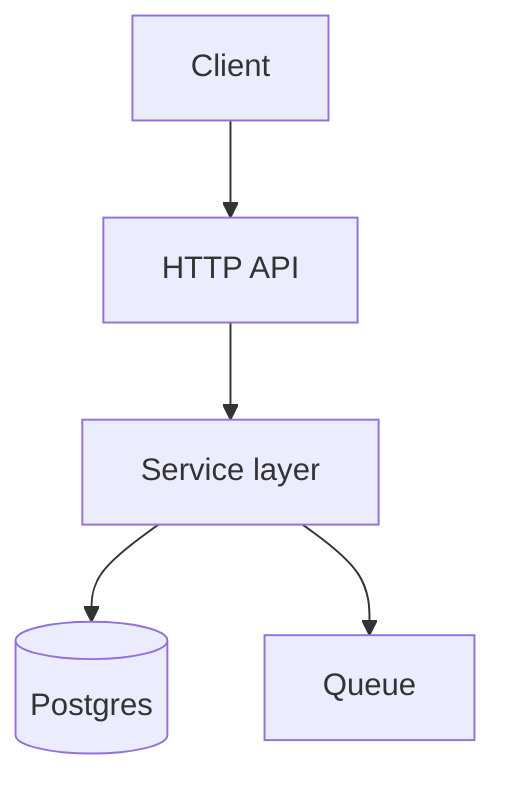

# Chapter Templates

Skeletons for all eleven chapters plus the ledger. Replace `{...}` placeholders. Omit any section with genuinely nothing in it — an empty heading is noise — **except** Open Questions, which is omitted only when truly empty.

Every chapter opens with the same front-matter line so it stands alone if read in isolation:

```markdown
> **Repo**: {owner}/{repo} · **Commit**: `{sha}` · **Generated**: {YYYY-MM-DD}
```

---

## `.coverage.md`

````markdown
# Coverage Ledger — {repo} @ `{sha}`

**Total**: {n} files · **Covered**: {n} · **N/A**: {n} · **Pending**: {n}

| File | Apparent role | Status | Chapter |
|------|---------------|--------|---------|
| `src/index.js` | HTTP entrypoint, wires router and starts server | covered | 03 |
| `src/db/pool.js` | Postgres connection pool | covered | 04 |
| `src/util/retry.js` | Exponential backoff helper | pending | |
| `package-lock.json` | lockfile | n/a — generated | |
````

Status is `pending`, `covered`, or `n/a — {reason}`. Update the counts whenever rows change. **Zero `pending` rows is the completion condition for the whole dossier.**

---

## `00-index.md`

````markdown
# {repo} — Dossier

> **Repo**: {owner}/{repo} · **Commit**: `{sha}` · **Generated**: {date}

{Two or three paragraphs: what this repo is, what it does, and the shape of it. Enough that someone who reads only this page can hold a conversation about the service.}

## Chapters

| # | Chapter | What's in it |
|---|---------|--------------|
| 01 | [Overview](./01-overview.md) | {teaser} |
| 02 | [Architecture](./02-architecture.md) | {teaser} |
| 03 | [Execution](./03-execution.md) | {teaser} |
| 04 | [Data & Configuration](./04-data-config.md) | {teaser} |
| 05 | [Integrations](./05-integrations.md) | {teaser} |
| 06 | [Delivery](./06-delivery.md) | {teaser} |
| 07 | [Patterns](./07-patterns.md) | {teaser} |
| 08 | [SWOT](./08-swot.md) | {teaser} |
| 09 | [Ownership](./09-ownership.md) | {teaser} |
| 10 | [Reading Path](./10-reading-path.md) | **Start here to read the code** |

## Headline findings

{The 3-5 things that would most surprise someone new to this repo. Each one cited. This is the highest-value section on the page — make it earn its place.}

## Coverage

{n} files analysed · {n} excluded as generated/vendored · 0 pending

## Open Questions

{Consolidated from every chapter — what the repository alone cannot answer. Take these to the team.}
````

---

## `01-overview.md`

````markdown
# Overview

> {front-matter}

## What this is

{Purpose in plain terms. The problem it solves, who consumes it, where it sits in a wider system.}

## Snapshot

| | |
|---|---|
| Primary language(s) | {lang} ({n}% of tracked files) |
| Ecosystem | {playbook matched} |
| First commit | {date} ({age}) |
| Last commit | {date} |
| Commits | {n} |
| Contributors | {n} |
| Licence | {licence} |
| Repo type | {service / library / CLI / monorepo / infrastructure} |

## Domain vocabulary

| Term | Meaning here |
|------|--------------|
| {term} | {what it means in this codebase, cited where defined} |

{Use these terms throughout the rest of the dossier. Do not substitute your own.}

## What the docs claim

{Summary of README/docs claims — and explicitly, any that the code contradicts. Contradictions get cited here and carried into 08-swot.md as weaknesses.}

## Open Questions
````

---

## `02-architecture.md`

````markdown
# Architecture

> {front-matter}

## Directory map

| Path | Responsibility |
|------|----------------|
| `src/api/` | {what lives here and why} |

## Entrypoints

Ranked by how much of the system each reaches.

| # | Entrypoint | Type | Reaches |
|---|-----------|------|---------|
| 1 | `src/server.js:12` | HTTP server | {what it governs} |
| 2 | `src/worker.js:8` | Queue consumer | {what it governs} |

## Layers and boundaries

{How concerns are separated, cited. Then — explicitly — where the separation leaks.}

## Component diagram



## Open Questions
````

---

## `03-execution.md`

The bulk of the dossier. One section per entrypoint; one subsection per feature reachable from it.

````markdown
# Execution

> {front-matter}

## {Entrypoint name} — `{path:line}`

{One paragraph: what this entrypoint is and when it runs.}

### {Feature or flow name}

**Trigger**: {what starts this — a request, a message, a schedule}

#### 1. {What happens} — `{path:line}`

{What to look at.}

```js
// src/api/handler.js:34
{verbatim snippet, ≤25 lines}
```

{What it means. What it hands off to next.}

#### 2. {Next hop} — `{path:line}`

...

> 🔌 **External boundary** — `{path:line}` calls {external tool}. {What it sends, what it expects back, what happens if it fails.}

#### Error paths

{What happens when this flow fails, cited. Often where the real design shows.}

## Open Questions
````

Flag every boundary crossing with the `🔌` callout — chapters 05 and 10 both consume them.

---

## `04-data-config.md`

````markdown
# Data & Configuration

> {front-matter}

## Data models

### {Model} — `{path:line}`
{Fields, types, constraints, relationships. Snippet of the definition.}

## Persistence
{Where queries live, what they touch, transaction boundaries.}

## Caching
{What's cached, keyed how, invalidated when — or explicitly: none found.}

## Configuration surface

| Variable | Read at | Default | Required | Effect if unset |
|----------|---------|---------|----------|-----------------|
| `DATABASE_URL` | `src/config.js:8` | none | yes | Process exits at boot |

## Secrets
{How supplied. Anything committed is a Threats entry — name the file, never reproduce the value.}

## Open Questions
````

---

## `05-integrations.md`

````markdown
# Integrations

> {front-matter}

## Dependency inventory

| Package | Version | Why it's here | Used at |
|---------|---------|---------------|---------|
| `pg` | 8.11.3 | Postgres driver | `src/db/pool.js:3` |

{Any dependency you cannot locate in source: flag as potentially unused.}

## Outbound HTTP

| Service | Endpoint | Called from | Timeout | Auth |
|---------|----------|-------------|---------|------|

## Messaging

| Broker | Channel | Direction | Site |
|--------|---------|-----------|------|

## Datastores

| Engine | Purpose | Connection | Pooling |
|--------|---------|------------|---------|

## Platform & third-party services
{Cloud SDKs, observability, auth, payments, feature flags — each with call sites.}

## Inbound surface

| Route / subscription | Handler | Auth |
|---------------------|---------|------|

## Open Questions
````

---

## `06-delivery.md`

````markdown
# Delivery

> {front-matter}

## Build
{Toolchain, artefact produced, containerisation. Dockerfile walked stage by stage.}

## Test
| Suite | Framework | Location | Runs in CI | Covers |
|-------|-----------|----------|-----------|--------|

{Then: what is *not* covered. More useful than what is.}

## CI/CD

### `.github/workflows/{file}` — {name}
**Triggers**: {events} · **Jobs**: {n}

#### Job: `{id}`
{Runner, matrix, steps in order, gates, secrets consumed. Walk it — do not summarise from job names; the gates live in `if:` conditions and step flags.}

## Infrastructure as code
{What infrastructure is declared, and where.}

## Environments & release

| Environment | Deployed by | Trigger | URL |
|-------------|-------------|---------|-----|

{Versioning and tagging conventions; release cadence from git tags.}

## Runtime
{How the process starts in production, health checks, scaling, observability.}

## Open Questions
````

---

## `07-patterns.md`

````markdown
# Patterns & Conventions

> {front-matter}

## {Convention name}

**The convention**: {one sentence}

```js
// {path:line}
{snippet}
```
```js
// {different path:line}
{snippet showing the same shape}
```

**Departures**: `{path:line}` does this differently — {how, and what a reader should watch for}.

{Repeat for: error handling, logging, dependency wiring, module shape, naming, async style, validation, test structure, commit/PR conventions.}

## Open Questions
````

---

## `08-swot.md`

````markdown
# SWOT

> {front-matter}

|  | Helpful | Harmful |
|---|---|---|
| **Internal** (the code) | {n} Strengths | {n} Weaknesses |
| **External** (deps, runtime, ecosystem, people) | {n} Opportunities | {n} Threats |

## Strengths

### S1 — {Practice} · `{path:line}`
{What they do and why it's good.}
```js
// {path:line}
{snippet}
```

## Weaknesses

### W1 — {Problem} · `{path:line}` · **{Severity}**
{What's wrong.}
```js
// {path:line}
{snippet}
```
**Failure mode**: {the concrete thing that goes wrong}

## Opportunities

### O1 — {Change} · **Effort: {Trivial|Small|Medium|Large}**
**Seam**: {the interface/harness/version that makes this cheap, cited}
**Change**: {what to do}
**Payoff**: {what it buys}

## Threats

### T1 — {Risk} · **{Severity}**
**Evidence**: {version + date, EOL date, CVE ID, or `path:line`}
**Exposure**: {what breaks, and when}

## Open Questions
````

Drop any entry that cannot meet its bar in `evidence-rules.md`. Do not soften it into the chapter.

---

## `09-ownership.md`

````markdown
# Ownership

> {front-matter}

## Declared ownership
{CODEOWNERS / MAINTAINERS, cited. Or: none found.}

## Contributors

| Contributor | Commits | First | Last | Areas |
|-------------|---------|-------|------|-------|

## Ownership by area

| Directory | Top author | Share | Last touched |
|-----------|-----------|-------|--------------|

## Bus factor
{Directories with one effective owner, or long untouched. Each is a Threats entry in 08.}

## Activity
{Commit cadence over time; churn hotspots; areas that have gone quiet.}

## Review norms
{From merged PRs: approvals required, review latency, squash vs merge, commit message conventions. Or: unavailable without `gh` — noted, not guessed.}

## Open Questions
````

---

## `10-reading-path.md`

The headline deliverable.

````markdown
# Reading Path

> {front-matter}

How to read this codebase in the order that makes it make sense. Ordered by comprehension dependency, not directory layout — you should never arrive at a file needing a concept this path hasn't introduced.

**Total**: {n} files across {n} sittings (~{n} hours)

## Where it all starts

| # | Entrypoint | Governs | Sitting |
|---|-----------|---------|---------|
| 1 | `src/server.js:12` | All HTTP traffic | 1 |

## Sitting 1 — {Theme}

**Goal**: {what you'll understand by the end}
**Files**: {n} · **~{n} min**

### 1.1 `{path}` — {why you're reading it}

**What to notice**: {the two or three things that matter here}
**Leads to**: `{next path}` — {via what call}

> 🔌 **Boundary** at `{path:line}` — {external tool}. {What crosses here.}

### 1.2 `{path}` — {why}
...

**✅ Checkpoint**: You now understand {specific capability}. You can answer: {a concrete question the reader should now be able to answer}.

## Sitting 2 — {Theme}
...

## External boundary summary

Every point where this service leaves itself, in reading order.

| Sitting | Location | External tool | What crosses |
|---------|----------|---------------|--------------|
| 1 | `src/db/pool.js:22` | Postgres | Connection + queries |

## What to skip

{Files safe to ignore on a first pass, and why — generated code, thin re-exports, boilerplate. Naming these saves as much time as the itinerary itself.}
````

---

## Formatting Rules

- **Paths** relative to the repository root, in backticks, never absolute, never including the cache directory
- **Citations** as `path:line` or `path:start-end`, attached to the specific claim they support
- **Snippets** verbatim, language-fenced, path comment first line, ~25 lines max, elisions marked `// … {what was cut} …`
- **Mermaid** for diagrams — no images, nothing requiring a build step
- **Tables** for anything enumerable; prose for anything requiring explanation
- **Boundary callouts** always use the `> 🔌 **External boundary**` form so they are greppable across chapters
- **Cross-links** relative (`./05-integrations.md#datastores`); full treatment in one chapter, links from the others
- **Numbering**: `S1`/`W1`/`O1`/`T1` in chapter 08, `{sitting}.{stop}` in chapter 10 — both are referenced from elsewhere, so keep them stable
